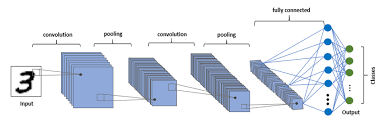

# Image Classification and Object Localization

## Table of Contents

1. [Overview](#overview)
2. [Description](#description)
   - [Dataset Synthesis](#dataset-synthesis)
   - [Model Architecture](#model-architecture)
   - [Training and Evaluation](#training-and-evaluation)
3. [Practical Advantages](#practical-advantages)
4. [Methodology](#methodology)
   - [Data Preprocessing](#data-preprocessing)
   - [Model Architecture](#model-architecture-1)
   - [Training](#training)
   - [Evaluation](#evaluation)
5. [Implementation](#implementation)
   - [Code Snippets](#code-snippets)
   - [Visualizations](#visualizations)
6. [Results](#results)
   - [Model Performance](#model-performance)
   - [Visual Results](#visual-results)
7. [Conclusion](#conclusion)
8. [References](#references)

## Overview

This project focuses on developing a Convolutional Neural Network (CNN) for image classification and object localization. The goal is to classify digits within images and accurately localize them by predicting bounding boxes. The model is trained on a synthesized dataset derived from the MNIST dataset, where digits are placed on a black canvas and annotated with bounding box coordinates.

## Description

The project comprises several key components:

### Dataset Synthesis

The dataset is synthesized by overlaying MNIST digit images onto a 75x75 pixel black canvas at random positions. Each image is accompanied by its corresponding bounding box coordinates, which define the precise location of the digit within the canvas.

### Model Architecture

The CNN architecture used in this project leverages TensorFlow's Functional API for flexibility and performance:

- **Feature Extraction**: Convolutional layers extract hierarchical features from input images.
- **Classification Branch**: Predicts the digit category (0-9) using a softmax activation function.
- **Bounding Box Regression Branch**: Predicts four numeric values (xmin, ymin, xmax, ymax) representing the coordinates of the bounding box around the digit.

### Training and Evaluation

The model is trained using TensorFlow's distributed training strategies (TPU or GPU) for accelerated performance:

- **Loss Functions**: 
  - **Classification**: Categorical cross-entropy measures the discrepancy between predicted and actual digit labels.
  - **Bounding Box Regression**: Mean squared error (MSE) quantifies the difference between predicted and true bounding box coordinates.
  
- **Optimizer**: Adam optimizer adjusts model weights to minimize loss during training.
  
- **Metrics**: 
  - **Classification Accuracy**: Measures the percentage of correctly classified digits.
  - **Bounding Box Accuracy**: Evaluated using Intersection over Union (IoU) to assess the overlap between predicted and true bounding boxes.

## Practical Advantages
-**Accurate Digit Localization**: 
The project excels in accurately localizing digits within images using bounding box predictions. This capability is essential for applications requiring precise object detection and localization, such as Optical Character Recognition (OCR) systems.

-**Scalability and Performance**: 
Leveraging TensorFlow's distributed training capabilities (TPU or GPU) ensures scalable performance, enabling faster model training and inference. This scalability is critical for handling large datasets and real-time applications.

-**Versatile Applications**: The project's methodology and architecture are adaptable to various domains and applications. Beyond digit recognition, the model's ability to localize objects within images can be extended to other object detection tasks in diverse fields like autonomous driving, retail analytics, and surveillance.

## Methodology

### Data Preprocessing

The dataset preprocessing involves:

- **Image Synthesis**: Overlaying MNIST digits onto black canvases and annotating with bounding boxes.
- **Normalization**: Scaling pixel values to the range [0, 1] for numerical stability.
- **Augmentation**: Augmenting data with random transformations to increase robustness.

  
Figure 1. Visualize synthesized images with overlaid digits and annotated bounding boxes

### Model Architecture

The CNN architecture consists of:

- **Convolutional Layers**: Extract features from input images through convolution and pooling operations.
  
  
  
  Figure 2. Diagram of CNN Layers
  
- **Classification Output**: Softmax activation predicts the digit category.
- **Bounding Box Regression**: Dense layer outputs coordinates for bounding box prediction.

### Training

Training involves:

- **Batch Processing**: Using TensorFlow's batch processing capabilities to handle large datasets efficiently.
- **Distributed Training**: Optimizing model training using TPU or GPU to accelerate computation.
- **Epoch Management**: Iteratively updating model parameters over multiple epochs to improve performance.

### Evaluation

Evaluation metrics include:

- **Classification Metrics**: Accuracy measures the model's ability to correctly classify digits.
- **Bounding Box Metrics**: IoU assesses the overlap between predicted and true bounding boxes.

## Implementation

### Code Snippets

-**Defining and compiling the model**

```python
model = tf.keras.Sequential([
    tf.keras.layers.Conv2D(16, kernel_size=(3, 3), activation='relu', input_shape=(75, 75, 1)),
    tf.keras.layers.MaxPooling2D(pool_size=(2, 2)),
    tf.keras.layers.Conv2D(32, kernel_size=(3, 3), activation='relu'),
    tf.keras.layers.MaxPooling2D(pool_size=(2, 2)),
    tf.keras.layers.Flatten(),
    tf.keras.layers.Dense(128, activation='relu'),
    tf.keras.layers.Dense(10, activation='softmax')
])

model.compile(optimizer='adam',
              loss='sparse_categorical_crossentropy',
              metrics=['accuracy'])
```

-**Training the model**
```python
model.fit(training_images, training_labels, epochs=10, validation_data=(validation_images, validation_labels))
```

### Visualizations
Include visualizations of:

-Dataset examples with overlaid bounding boxes.
-Model architecture (layer diagrams).
-Training and validation curves (loss and accuracy plots).
## Results
**Model Performance**

-Accuracy: Achieved classification accuracy on validation set.
-IoU Scores: IoU scores demonstrating bounding box prediction accuracy.

**Visual Results**

Visualize predictions on sample images:

-True vs. Predicted bounding boxes.
-Correct vs. Incorrect classifications.

## Conclusion
Summarizing project achievements, insights gained, and potential future improvements:

-**Achievements**: Successful development of a CNN for image classification and object localization.

-**Insights**: Understanding of CNN architecture, training strategies, and evaluation metrics.

-**Future Work**: Potential enhancements in model robustness, dataset diversity, and real-world deployment.
## References
TensorFlow Documentation: https://www.tensorflow.org/

MNIST Dataset Documentation: http://yann.lecun.com/exdb/mnist/
